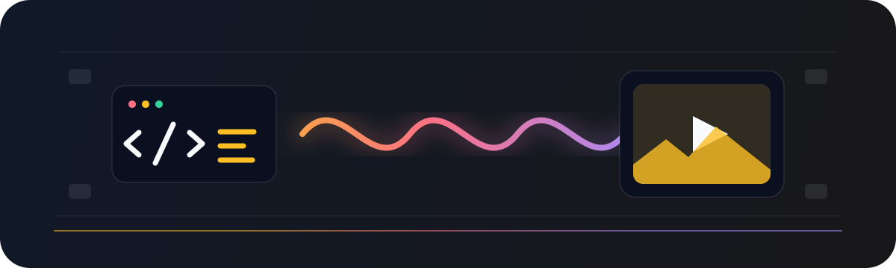

# Awesome Video as Code 

  

> Curated tools, agent skills, production workflows, source-available showcases, and research for creating videos with code written or directed by AI agents.

**English** · [简体中文](README.zh-CN.md)

Video as code treats executable source as the visual medium: an agent writes HTML, Canvas, SVG, React, TypeScript, or Python, and a browser or rendering engine turns it into video. This list focuses on that inspectable, programmable workflow. Tools that orchestrate pixel-generating video models are included only when their agent or pipeline design is directly useful to video-as-code practitioners.

## Contents

- [Start Here](#start-here)
- [Frameworks and Renderers](#frameworks-and-renderers)
- [Agent Skills and Tooling](#agent-skills-and-tooling)
- [MCP Servers and Integrations](#mcp-servers-and-integrations)
- [Production Pipeline](#production-pipeline)
- [Showcases](#showcases)
- [Research](#research)
- [Learning](#learning)

## Start Here

<table>
  <thead>
    <tr><th>If you want to…</th><th>Start with…</th></tr>
  </thead>
  <tbody>
    <tr><td>Build videos with ordinary HTML, CSS, and JavaScript</td><td>Frameworks and Renderers</td></tr>
    <tr><td>Compose videos as React components</td><td>Frameworks and Renderers</td></tr>
    <tr><td>Create technical or mathematical animation</td><td>Frameworks and Renderers</td></tr>
    <tr><td>Give an agent a specialized video-making workflow</td><td>Agent Skills and Tooling</td></tr>
    <tr><td>Add audio, captions, assets, or automated rendering</td><td>Production Pipeline</td></tr>
    <tr><td>Learn from complete projects with public source code</td><td>Showcases</td></tr>
  </tbody>
</table>

The core path is **brief → agent → executable visual code → deterministic renderer → video file**. Generated-video APIs, stock-footage assembly, and screen recording are adjacent paths, not the primary scope of this list.

<table>
  <thead>
    <tr><th>Label</th><th>Meaning</th></tr>
  </thead>
  <tbody>
    <tr><td><strong>Code-rendered</strong></td><td>Code defines the frames or scene graph; a browser or graphics engine produces the pixels.</td></tr>
    <tr><td><strong>Hybrid</strong></td><td>Code assembles ordinary media and may optionally include model-generated assets.</td></tr>
    <tr><td><strong>Pipeline</strong></td><td>Supporting infrastructure for capture, timelines, transcription, encoding, or delivery.</td></tr>
  </tbody>
</table>

## Frameworks and Renderers

- [Remotion](https://github.com/remotion-dev/remotion) - Code-rendered React framework, Studio, player, and rendering stack for programmatic video; source-available under the Remotion License.
- [HyperFrames](https://github.com/heygen-com/hyperframes) - Code-rendered HTML video framework with seekable animation adapters and deterministic Chrome-and-FFmpeg rendering.
- [Motion Canvas](https://github.com/motion-canvas/motion-canvas) - Code-rendered TypeScript framework and real-time editor for explanatory vector animations synchronized with voice-over.
- [Manim Community](https://github.com/ManimCommunity/manim) - Code-rendered Python engine for precise mathematical and technical animations.
- [Revideo](https://github.com/midrender/revideo) - Code-rendered TypeScript framework with parameterized templates, a player, and headless rendering for video applications.
- [MoviePy](https://github.com/Zulko/moviepy) - Hybrid Python library for scripted cutting, compositing, effects, titles, and encoding.
- [p5.js](https://github.com/processing/p5.js) - Code-rendered creative-coding library for Canvas and WebGL visuals that can be captured frame by frame.
- [Three.js](https://github.com/mrdoob/three.js) - Code-rendered JavaScript 3D engine for WebGL scenes that can be captured by browser-based video renderers.

## Agent Skills and Tooling

- [Remotion Agent Skills](https://github.com/remotion-dev/skills) - Code-rendered first-party agent instructions for composition, animation, audio, captions, transitions, and rendering with Remotion.
- [HyperFrames Skills](https://github.com/heygen-com/hyperframes/tree/main/skills) - Code-rendered first-party skills for planning, creating, checking, previewing, editing, and rendering HyperFrames projects.
- [Claude Code Video Toolkit](https://github.com/digitalsamba/claude-code-video-toolkit) - Hybrid agent workspace combining Remotion, FFmpeg, browser recording, transcription, voice, music, and generated assets.
- [Motion Skills](https://github.com/iart-ai/motion-skills) - Code-rendered installable skills for kinetic type, explainers, data visualization, short-form video, WebGL, and Manim.
- [Claude Motion Design](https://github.com/howseen-ai/claude-motion-design) - Code-rendered skill and examples for creating motion graphics in HTML and rendering them with Playwright and FFmpeg.
- [Videowright](https://github.com/scosman/videowright) - Code-rendered coding-agent workflow for assembling animated explainer videos from structured plans and source-controlled assets.

## MCP Servers and Integrations

- [Pireel](https://github.com/pireel/pireel) - Hybrid timeline editor whose agent plugin lets MCP-capable agents edit cuts, captions, graphics, audio, and exports while a person retains GUI control.
- [OpenVidStudio](https://github.com/AnayDhawan/openvidstudio) - Hybrid MCP workflow that captures a real application with Playwright and composes product footage with Remotion.
- [mimic-mcp](https://github.com/pouyashahrdami/mimic-mcp) - Hybrid MCP server that analyzes a reference reel, scaffolds a Remotion project from supplied footage, renders it, and performs a visual review.
- [Blender MCP](https://github.com/ahujasid/mcp-for-blender) - Code-rendered community integration that lets language models control Blender scenes and render conventional 3D animation.

## Production Pipeline

- [FFmpeg](https://ffmpeg.org/) - Pipeline toolkit for encoding, muxing, filtering, audio mixing, probing, and format conversion.
- [OpenTimelineIO](https://github.com/AcademySoftwareFoundation/OpenTimelineIO) - Pipeline interchange format and API for editorial timelines, clips, tracks, transitions, and adapters.
- [Whisper](https://github.com/openai/whisper) - Pipeline speech-recognition model and reference implementation for producing transcripts for subtitle workflows.
- [WhisperX](https://github.com/m-bain/whisperX) - Pipeline transcription tool with word-level alignment and optional diarization for caption timing.
- [ffmpeg.wasm](https://github.com/ffmpegwasm/ffmpeg.wasm) - Pipeline WebAssembly port of FFmpeg for browser-side media conversion and assembly.

## Showcases

Projects in this section publish source code, prompts, or production notes that reveal how the video was made.

- [PDoomVideo](https://github.com/JohnHeibel/PDoomVideo) - Code-rendered music video project with p5.js and p5.brush source, a storyboard, an animation guide, and a browser renderer.
- [ClaudeAnimationBase](https://github.com/JohnHeibel/ClaudeAnimationBase) - Code-rendered starter project with p5.js rendering, a hand-painted character, reusable emotional performances, and coding-agent instructions.
- [Lemo Opuscar](https://github.com/lemomo-ai/lemo-opuscar) - Code-rendered collection of short films paired with reusable visual-style prompts and directing guidance.
- [Zero to Product Video Hero](https://github.com/specstoryai/zero-to-product-video-hero) - Code-rendered Remotion project publishing the composition source, output, production plan, and agent conversation for a product video.

## Research

- [Manimator: Transforming Research Papers into Visual Explanations](https://arxiv.org/abs/2507.14306) - Code-rendered two-stage system that turns papers or prompts into structured scenes and executable Manim code.
- [Training and Agentic Inference Strategies for LLM-Based Manim Animation Generation](https://arxiv.org/abs/2604.18364) - Code-rendered study of supervised training, reinforcement learning, renderer feedback, documentation retrieval, and evaluation for text-to-Manim systems.
- [LLM2Manim: Pedagogy-Aware AI Generation of STEM Animations](https://arxiv.org/abs/2604.05266) - Code-rendered human-in-the-loop pipeline using constrained prompts, symbol consistency, targeted regeneration, narration, and expert review.
- [PhysicsSolutionAgent](https://arxiv.org/abs/2601.13453) - Code-rendered agent that produces multi-minute Manim explanations and iteratively checks them with quantitative rules and visual-model feedback.

## Learning

- [Remotion Documentation](https://www.remotion.dev/docs/) - Official introduction to creating React compositions, previewing them in Remotion Studio, and rendering video.
- [Remotion Agent Skills Guide](https://www.remotion.dev/docs/ai/skills) - Official guide to Remotion's creation, editing, rendering, captioning, multimedia, and application-building skills.
- [HyperFrames Quickstart](https://hyperframes.heygen.com/quickstart) - Official walkthrough for creating and rendering a deterministic HTML composition with an agent or by hand.
- [HyperFrames Prompt Guide](https://hyperframes.heygen.com/guides/prompting) - First-party guidance for writing briefs, supplying context, iterating with motion vocabulary, and avoiding common failures.
- [Motion Canvas Quickstart](https://motioncanvas.io/docs/quickstart/) - Official introduction to scenes, generator functions, real-time preview, and rendering.
- [Manim Example Gallery](https://docs.manim.community/en/stable/examples.html) - Official gallery pairing rendered mathematical animations with the Python source that produced them.

## Related Lists

- [Awesome Opus 5.5 Videos](https://github.com/yihui-dev/awesome-opus5-5-videos) - Model-specific gallery of prompts, source posts, and live remakes for Claude Opus 5.5 video experiments.
- [Awesome Claude 5.5 Videos](https://github.com/athemeroy/awesome-claude-5-5-videos) - Source-linked catalog that records prompts, tools, production evidence, and model variants.
- [Awesome Creative Coding](https://github.com/terkelg/awesome-creative-coding) - Creative-coding tools, frameworks, books, tutorials, and communities across visual media.
- [Awesome Web Animation](https://github.com/sergey-pimenov/awesome-web-animation) - Browser animation libraries and learning resources for SVG, CSS, Canvas, JavaScript, and React.

## Contributing

Contributions are welcome. Please read the [contribution guidelines](contributing.md) before submitting a resource.
